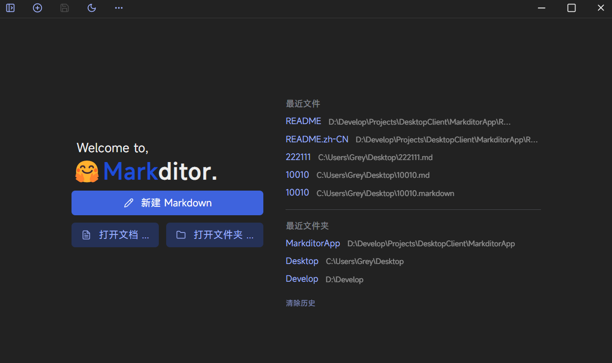
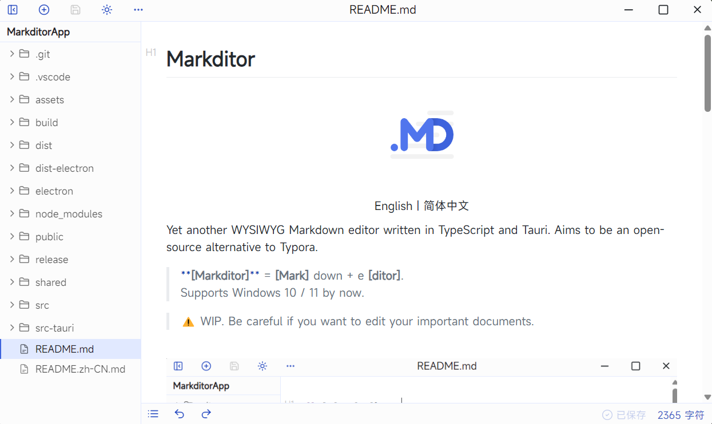
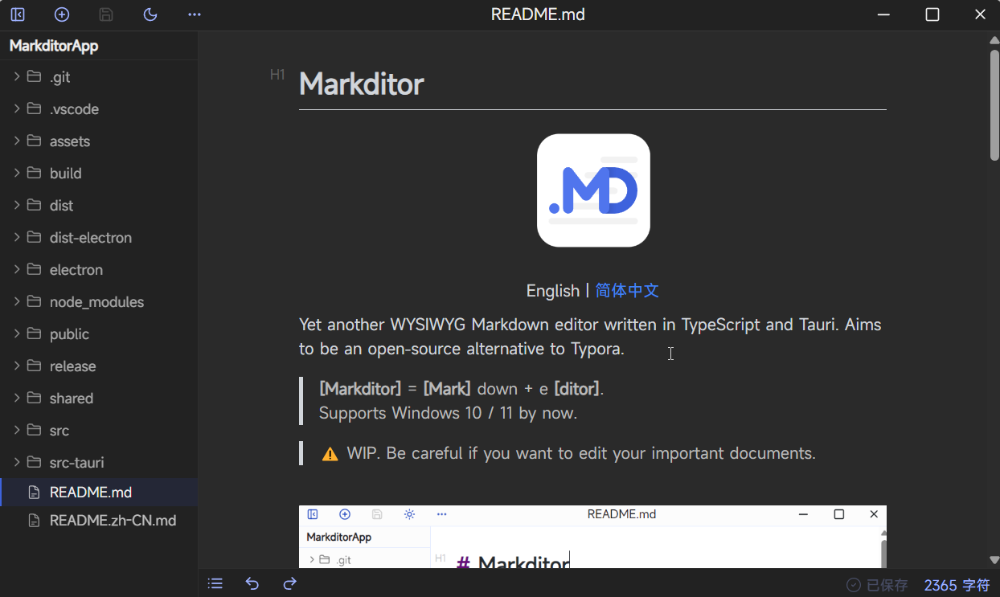

# Markditor

<p align="center" style="margin-bottom:10px">
  
  <br>
  <a href="./README.md">English</a> | 简体中文
</p>

又一个所见即所得的 Markdown 编辑器，使用 TypeScript 和 Tauri 编写。定一个小目标：成为Typora的精简版和它的开源替代品。

> **[Markditor]** = **[Mark]** down + e **[ditor]**。目前仅支持 Windows 10 / 11。

> ⚠️ 正在开发中，谨慎用它编辑重要文档。


| light                                      | dark                                      |
| ------------------------------------------ | ----------------------------------------- |
|  |   |
|  |  |

## 技术栈

Markditor 的编辑功能基于 [Vditor](https://github.com/Vanessa219/vditor) 的修改版 [(查看仓库)](https://github.com/greyovo/vditor)。此外，还使用了以下技术栈：

- React
- **Tauri**（首选）/ Electron
- Zustand
- Radix-UI
- Tailwind CSS
- Vite

## 特性

* 实时渲染 Markdown
* 易用的表格编辑器
* 自动保存
* 支持深色模式

## 下载

前往[发布页面](https://github.com/greyovo/MarkditorApp/releases)。

## TODOs

* [ ]  国际化（i18n）
* [ ]  插入图片：拖放、粘贴（自动复制到 `asset` 文件夹）
* [ ]  拖放文件：打开文件或插入图片
* [ ]  优化文件管理：拖放移动文件、监视外部文件更改、在切换窗口时自动保存
* [ ]  源代码模式
* [ ]  导出为：PDF 或 HTML
* [ ]  支持 macOS、Linux（技术上可行，但缺乏设备来测试）

## 项目架构

```
├─build           // 用于 electron-builder 的构建资源
├─dist            // Web 内容的构建输出
├─dist-electron   // Electron 预构建文件
├─electron        // Electron 主进程
├─public          // HTML 引用的公共文件
├─release         // Electron 构建输出
├─shared          // 在渲染器和主进程之间共享的类型定义文件
├─src             // 前端源代码
│  ├─assets       // 静态资源，例如字体
│  ├─components   // 全局组件
│  ├─feat         // 功能模块
│  ├─ipc          // IPC 通信
│  ├─store        // Zustand 状态管理和业务逻辑
│  ├─types        // 全局类型定义
│  └─utils        // 工具函数
└─src-tauri       // Tauri 后端进程和构建输出
```

## 开发

> 注意：Markditor 最初是用 Electron 构建的，**但现在使用 Tauri**。目前 Electron 相关代码中仍有一些未实现的业务 API，详见 `electron/main/handler`。未来可能会弃用 Electron。
>
> 通过封装 IPC 通信（见 `shared/platform_api.d.ts` 和 `src/ipc`），Markditor 可以很快地迁移到其他后端，如 Tauri。

安装依赖：

```bash
npm install
```

以开发模式运行：

```bash
# 使用 Tauri（首选）
npm run dev:tauri

# 使用 Electron
npm run dev:electron
```

构建产品：

```bash
# 使用 Tauri（首选）
npm run build:tauri

# 使用 Electron
npm run build:electron
```
